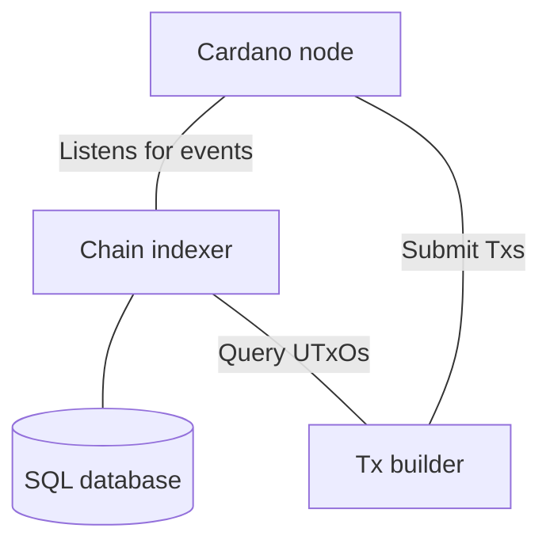
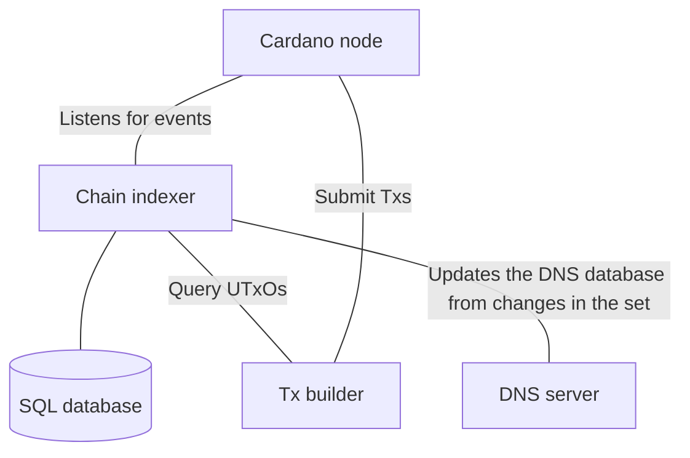

# Design & Architecture

## Requirements (Conceptual)

The DeNS protocol must support a small list of essential features to deliver on the promise of a decentralized, transparent, censorship-resistant, and privacy-conscious successor to the DNS protocol.
These features are:

- Records must be stored in an immutable, permanent, and public database.
- Users must have the ability (at least in principle) to resolve queries _locally_ - that is, it ought to be possible for a user to reconstruct the DeNS database solely from public information, and use that database to resolve queries without sharing those queries (or the identity of the user) with any third party
- Users must be provided with direct control over their records, such that they can update those records without the assent or intervention of any third party.
- Users must have the ability to transfer ownership of their records without the assent or intervention of any third party.
- It must be possible to reconstruct a database, suitable for use as the primary database mapping domain names to resources in a DNS resolver, from these public records
- A viable and orderly transition path from traditional DNS must exist, such that existing users of DNS can gradually migrate to the DeNS protocol

The last feature requires further elaboration and discussion. A 'transition path', for the purposes of this document, can be understood in two ways: First, from the perspective of end-users of the system, a DeNS transition path requires that they be able to interact with DeNS to resolve traditional DNS queries while benefiting from the advantages of decentralization, transparency, etc. Second, from the perspective of (DNS) domain owners and operators, a transition path requires that DeNS (temporarily) delegates authority over existing DNS records to the authoritative sources of those records in the existing DNS system.

As far as we can determine, the only way to delegate authority over existing DNS records to their authoritative source in traditional DNS without abandoning some other required feature is to _mirror existing DNS records in the DeNS system_. This entails a further design constraint: It must be _economically feasible_ to perform DNS record mirroring in DeNS. While this is, in some sense, an implementation detail, it is nevertheless an essential requirement which must guide the rest of the design.

## Overview: A Cross-Chain Database (Conceptual)

The constraints outlined in the previous section give rise to an apparent dilemma: The Web3 technologies which are most suitable for the _data-storage_ functionality (Arweave, IPFS, other distributed storage solutions) are inadequate for implementing the transaction logic, while, conversely, the Web3 technologies most suited to implement transaction logic necessary for users to have meaningful control over their records (Cardano and other smart-contract capable blockchains) are unsuitable for storing the large (relative to typical smart contracts) amounts of data necessary for a protocol that aims to replace DNS in its entirety.

Fortunately, this dilemma only poses a problem under the assumption that the database of DeNS records must exist "in one place". Were that the case, we would be forced to choose between two unsatisfactory and cumbersome solutions: Either we would have to implement complex smart contract logic on a platform designed primarily for data storage, or implement data storage on a platform designed for contract logic. This assumption, however, is false. If we think of a database as an abstract structure that (logically) associates values (or sets of values) with specific keys, it is clear that a logical relation can be established between keys and values located on entirely distinct Web3 technologies.

This insight motivates the general architecture of the DeNS (onchain) protocol: DeNS will consist in a cross-chain database, such that contract logic (creating, updating, deleting, transferring ownership of) records is performed on a smart-contract capable blockchain, while data-storage is performed on a blockchain (or similar Web3 technology) designed for efficient storage and retrieval of data. Transactions on the smart-contract blockchain do not contain records as such ("inline"), but rather contain _pointers_ (references, addresses) to resources on the data-storage Web3 platform. When constructing the database of records to be used in a resolver, transactions on the smart-contract blockchain serve as a source of authorization - only those records which are properly referenced in a suitable transaction on the smart-contract blockchain will be retrieved from the data-store and included in the final data set.

## Root Domain Topography (Conceptual)

Before moving to a detailed discussion of the DeNS protocol architecture, it is necessary to first clarify exactly what is meant (conceptually) by "names" and "records" - and, perhaps most importantly, by "ownership" - in DeNS. To motivate this discussion, it will be helpful to look at the format of a DNS record, here represented as a Haskell data type (we ignore the inner structure of DNS names and resource data here, as these are not important at this level of discussion):

```haskell
data DNSRecord =
  DNSRecord {
    name     :: DNSName,
    type     :: Word16,
    class    :: Word16,
    ttl      :: Word32,
    rdLength :: Word16,
    rData    :: ResourceData
  }
```

Although it is commonplace (and perfectly fine in most circumstances) to think of DNS records as representing a mapping from a human-readable name to a machine-readable IP address, this is not strictly correct. The `class` field in a DNS record indicates the protocol that the record is concerned with, and one must know the class in order to interpret the `type` field (and consequently the `rData` field as well). In almost every interaction with DNS, the `class` can be assumed to be `1`, which indicates an IP (Internet Protocol) record (`A`,`AAAA`,`MX`, etc) - the family of records with which most developers are familiar.

While this may seem like a minor technical detail, it motivates several important questions about the nature of ownership, names, and records in DeNS. Because DeNS aims to support both "traditional DNS records" (which we can now operationally define as: IP class records of types specified in the relevant DNS RFCs) and new classes of records that support a variety of Web3 naming protocols, we cannot maintain the illusion that all records are IP class records. Furthermore, if we wish to sell access rights for the records associated with a given name, we must be able to specify precisely the criteria by which a record is "associated with a given name". That is: We must be able to tell our potential customers exactly what it is they are buying.

We anticipate that, in the future, DeNS will support a variety of name systems. Some of them may integrate with DeNS at a deep level, such that transactions are always processed by a DeNS contract. However, we would also like to support (name resolution for) autonomous protocols which are not managed by DeNS contracts and therefore cannot assume that a single name (i.e. the value of the `name` field) is owned by the same entity in each supported protocol. Consequently, in DeNS, "ownership" must mean: Delegated control over the records associated with a `(Name,Class)` pair, where a record `R` is associated with a name/class pair `(N,C)` iff `R.name == N && R.class == C`.

Similarly, at the highest level there are no "bare names" in DeNS. A DeNS name exists in a _Name-Universe_ which is indicated by the associated class (or, if you prefer, by the protocol the class refers to).

Records in DeNS, then, are just ordinary DNS records. However, in order to maximize the number of additional protocols that DeNS support, and to reduce the burden of supporting obsolete protocols, we will consider all existing DNS record classes other than 1 (IP) to be deprecated. We will not consider ourselves obliged to support these protocols, and we reserve the right to reassign their class identifier at our discretion.

The considerations raised in this section also constrain the logical structure of the DeNS root domain. In particular, the DeNS root domain must be _universal_ in a sense in which the DNS root domain is not. To elaborate: What we ordinarily refer to as the DNS root domain - the set of zone files served by DNS root servers - is really _a_ DNS root domain. Namely, it is the root domain for the IP class. There are [other](https://chaosnet.net/chaos-dns) root domains for non-IP classes, and (e.g.) the Chaosnet root domain and the IP root domain are utterly distinct from one another. In this sense, the existing DNS root domain is not universal.

DeNS, by contrast, will be universal. Concretely, this implies that the records which constitute the DeNS top-level root domain will contain resources which are associated with a _class_, and not, as with DNS, a top-level domain. In this way, we can support a wide variety of different protocols, including protocols that serve as their own autonomous top-level domain.

This architecture allows us to specify more clearly the mechanics of the transition away from DNS as an authority for IP records: We will lease the IP class of domains to ourselves and maintain mirrors of DNS records until DeNS adoption reaches a level that we judge sufficient to facilitate a "hard fork" from DNS authority. At that point, we will let the lease expire and IP class domains in DeNS will be directly managed by domain owners via DeNS smart contracts.

## Architecture - Cardano (Technical) (WIP)

TODO/FIXME: Everything here assumes that domain ownership is eternal/indefinite. In practice that won't work, and we'll have to modify this design to accommodate a "lease" model instead of a "permanent control" model.

### Protocol NFT

All contract scripts will be parameterized by a `Protocol` NFT that uniquely identifies a UTxO which as datum contains the configuration (trusted knowledge of Plutus scripts) of the protocol. More precisely, the `Protocol` NFT must be paid to an unspendable validator, say `ProtocolValidator`, which has the following as datum.

```haskell
data Protocol = Protocol
  { elementIdMintingPolicy :: ScriptHash
  , setElemMintingPolicy :: ScriptHash
  , setValidator :: ScriptHash
  , recordsValidator :: ScriptHash
  }
```

**DISCUSSION:** The `Protocol` NFT acts as a single source of truth for the protocol. This is advantageous because of the following.

- It allows one to easily refer to other Plutus scripts within the protocol without the worry of cyclic dependencies.
- It gives the a trustless setup since every `Protocol` NFT must be paid to the unspendable validator `ProtocolValidator`, so participants may verify offchain that the datum `Protocol` is "as expected" without the need to scan through all transactions in the blockchain.
- If one may extends the `ProtocolValidator` to be spent under controlled conditions, then since the `Protocol` NFT acts as the single source of truth, one may effectively update the protocol dynamically.

### Record Keys and Values

Morally, the DeNS protocol is a cross-chain distributed Key-Value store, where the key component is a `(Name,Class)` pair managed by a Cardano smart-contract, and the value is a pointer to an Arweave resource which in turn contains a set of records.

```haskell
{-
  This data type contains all of the elements necessary to function as a key in our logical database.
-}
data DeNSKey
  = DeNSKey
    { densName  :: ByteString
        -- ^ A human readable domain name
    , densClass :: Word16
        -- ^ Each set represents a Name Universe and must be tagged w/ the class ID corresponding to that universe
    }

-- By convention, this should be an Arweave resource address. `Nothing` indicates a deleted record
newtype DeNSValue = DeNSValue { densPointer :: Maybe ByteString }
```

Note that `DeNSKey`s may be ordered by defining `DeNSKey n1 c1 <= DeNSKey n2 c2` iff `(n1, c1) <= (n2, c2)` i.e., `DeNSKey`s are ordered lexicographically using the lexicographical ordering of `ByteString` and the natural ordering of `Word16`s.

### Set Validator / ELEMENTID Minting Policy

The most important invariant that the protocol must maintain is the _uniqueness of names_ in the set of onchain keys. Unfortunately, we cannot adopt the naive approach of using an onchain List to represent this set. Because such a list could conceivably grow to include _tens of millions_ (or more!) entries, and because traversing a list that large would assuredly exceed Cardano ExUnit limits, we are forced to adopt a more sophisticated solution. First, we will require a data type to represent entries in our set:

```haskell
data SetDatum
  = SetDatum
    { key :: DeNSKey
        -- ^ This entry's key
    , next :: DeNSKey
        -- ^ The successor to key
  }
```

#### SetElemID Minting Policy

The `SetValidator` locks UTxOs containing `SetDatum` entries and is used alongside with `SetElemID` to represent the on-chain collection of unique keys. We initialize the set by locking a UTXO with `SetDatum (DeNSKey "" 0) (DeNSKey ub (2^16 - 1)` at the validator (which can be assumed to exist for validation checks) when minting `Protocol` NFT (to ensure uniqueness of the linked list) where `ub` is the minimal upper bound (under lexicographical ordering) of all `ByteString`s that are DNS names (see [2.3.4. of RFC  1035](https://www.ietf.org/rfc/rfc1035.txt)) which is itself not a DNS name.
`SetElemID` will identify a subset of all `SetValidator`s on the blockchain to distinguish the `SetValidator`s relevant to the protocol as opposed to random `SetValidator` addresses adversaries may have paid to.

`SetElemID` will mint in two cases. The first case is the trivial initialization case -- it mints only if all of the following are satisfied.

- `Protocol` NFT has minted.

- There is a unique `SetDatum` initialized as above at `SetValidator` in the outputs.

- There is no `SetValidator`s in the inputs

- No `ElementID` has minted.

The other case is more tricky.

Let

- `DeNSKey N C = densKey` designate a new Name/Class pair for which we would like to mint an **ElementID** NFT
- `SD(k,nxt)`designate a SetDatum such that `key = k, next = nxt`

**INPUTS:**

- A UTxO (locked at `SetValidator` with a `SetElemID` token) `SD(k,nxt)` where k < densKey < nxt

**OUTPUTS:**

- A UTxO `SD(k, densKey)` (paid to the Set Validator) with a `SetElemID` token.
- A UTxO `SD(densKey, nxt)` (paid to the Set Validator) with a `SetElemID` token.

**MINTS**:

- One `SetElemID` NFT
- One `ElementID` NFT with token name `blake2b_256(serialiseData(densKey))`

**REDEEMER**:

```haskell
data SetInsert = SetInsert
    { densKey :: DeNSKey
    }
```

**CHECKS:**

- The transaction corresponds to the above schema exactly.

**DISCUSSION:**

- Because the set is initialized with a lower bound and upper bound, inserting an arbitrary name `n` always amounts to inserting `n` after some _known_ name `m` where `m < n` and before some known name `o` s.t. `n < o`.

**EXTENSIONS:**

- Since the `SetElemID` token name isn't used, it should be the empty string to save bytes.
- It is possible to introduce a hierarchical ownership of names (e.g. `DeNSKey 1 "google.com."` may be purchased only if the owner of `DeNSKey 1 "com."` approves such a sale). We only describe the inductive case, and leave the base case up to implementations where the owner of the empty domain (for each class) would be coded directly in the smart contract.  First, we will assume that a function `parse :: ByteString -> [ByteString]` exists which maps names like `"google.com"` to `["google", "com"]` i.e., `parse` decomposes a `name` into its labels, and if `parse n1` is a suffix of `parse n2`, then we say that `n2` is a subdomain of `n1` (see [2.3.1](https://www.ietf.org/rfc/rfc1035.txt)). We will also assume there exists a function `unparse :: [ByteString] -> ByteString` that is the inverse of `parse`. The key idea is that a subdomain must verify that the domain immediately "above" has approved purchasing the subdomain's name.

  We modify the datum and redeemer as follows.

  ```diff
  data SetDatum
    = SetDatum
      { key :: DeNSKey
      , next :: DeNSKey
  +   , ownerApproval :: CurrencySymbol
  +       -- ^ A token which must mint in order for a subdomain to be bought
    }
  ```

  ```haskell
  data SetInsert = SetInsert
      { densKey :: DeNSKey
  +   , ownerApproval :: CurrencySymbol
      }
  ```

  Let `SD(k,nxt,o)` denote a `SetDatum` with `key = k, next = nxt, ownerApproval = o`.

  Now, the transaction where `SetElemID` mints must conform to the following schema when given redeemer `SetInsert{densKey, ownerApproval}` where `densKey = DeNSKey N C` and `n:ns = parse N`.

  **INPUTS:**
  - A UTxO (locked at `SetValidator` with a `SetElemID` token) `SD(k,nxt,o)` where k < densKey < nxt

  **REFERENCE INPUTS:**
  - A UTxO (locked at `SetValidator` with a `SetElemID` token) `SD(unparse ns, _, domainOwner)`

  **OUTPUTS:**
  - A UTxO `SD(k,densKey,o)` (paid to the `SetValidator`) with a `SetElemID` token
  - A UTxO `SD(densKey,nxt,ownerApproval)` (paid to the `SetValidator`) with a `SetElemID` token

  **MINTS**:
  - One `SetElemID` NFT with token name.
  - One `ElementID` NFT with token name `blake2b_256(serialiseData(densKey))`
  - At least one token from the `domainOwner` from the reference input is minted.

  Note how the `ownerApproval` is an extra check to verify that this subdomain purchase has been approved by the domain immediately "above" it. A simple `ownerApproval` script could verify if some public key has signed the transaction, or some token (controlled by the owner) has been burned.

- One may consider to not allow `DeNSKey`s with empty strings to be inserted.

#### SetValidator validator

`SetValidator` is the validator address which holds the elements in the logical database. It simply validates only if `SetElemID` mints i.e., it forwards all verifications to `SetElemID`.

**DISCUSSION:**
Since `SetValidator` forwards everything to `SetElemID`, this makes the potential for upgrading to a new `SetElemID` convenient as swapping to a new `SetElemID'` would still keep existing `SetElemID` already at `SetValidator` meaning there would be no need for a large migration of tokens.

#### ElementID Minting Policy

The `ElementID` minting policy is an NFT which serves as an access control identifier in order to gate access to specific records in the virtual DeNS database.

**CHECKS:**:

- `SetElemID` mints in the same transaction

**DISCUSSION:**

This forwards all verifications to `SetElemID` whose minting is unique w.r.t to the element inserted in the set, and ensures that this `ElementID`'s token name contains sufficient information to identify it with the inserted element.

### Records Validator

The records validator serves as an access control list for the virtual DeNS database. When the offchain code reconstructs the database from Cardano keys and Arweave values, it treats the records locked at the Records validator identified with a `ElementID` token as the source of authority. That is: Only records locked at the records validator are used to construct the database used in a DeNS resolver.

**PARAMETERS**:

- The Protocol NFT

**DATUM**:

The Records Validator datum functions as the key in our virtual database. To update or create a record, a DeNS user simply adjusts the reference for the class and name that they own. To delete a record, the user submits a transaction with an output datum where the `reference` field is `Nothing`.

```haskell
data DeNSKey = DeNSKey
    { class :: Word32
    , name  :: ByteString
    , reference :: Maybe ByteString
        -- ^ an Arweave address
    , owner :: PubKeyHash
}
```

The offchain code that constructs the DeNS database will always treat the _most recent_ record associated with a given name as authoritative, and consequently we do not need to distinguish between record creation and record deletion. (Unlike the `SetValidator`, we do not need a simulated Map or Set).

**INPUTS:**

- A UTxO containing a NFT where the AssetClass consists of a CurrencySymbol == the hash of the ElementID MintingPolicy and where the token name is (or should be) == the blake2b hash calculated from `blake2b_256 (serialiseData(redeemer.class , redeemer.name))`

**OUTPUTS:**

- A UTxO, paid to the Records Validator, which contains the `DeNSKey` passed by the user

**MINTS**: N/A

**CHECKS:**

- The transaction is signed by `owner`

**DISCUSSION:** Since the `owner` owns the token, this validator gives them "free reign" to update it as they please. In practise, to not confuse offchain code and devalue one's own Records (by e.g. giving it to someone else for free), one would most likely want to check the following conditions as well

- The NFT in the inputs contains a token that satisfies the constraints outlined above in the section
- The output contains a single UTxO with an _inline_ `DeNSKey` datum which is equal to the input passed in by the user
- This output UTxO is paid to the validator

## Architecture - Arweave (Technical) (WIP)

It seems that the maximum amount of data we can upload paying the minimum amount possible is:

```bash
https://arweave.net/price/256000
212017846
```

This price is given in Wilson, where a Wilson is related to Ar (the arweave currency) as:

```python
Ar = 1e12 wilson
```

At today the price of an Ar is around `9.5` usd, this means that the minimum cost of a transaction is : `0.002014169537` usd.
And the maximum size of a transaction with such a price is above 250 KB.

Additionally some gateways allows the upload of certain amount of bytes for free.

Those are the reason we choose to store every set of records in a particular zone file as a single transaction.

### Initial Upload

Initially we have a setup like this:

```bash
ZoneCOM.txt
ZoneNET.txt
.
.
.
ZoneSome.txt
```

Every zone file will be split on smaller chunks of size `ORIGINAL_CHUNK_SIZE` (To be defined).
Then using the services of a bundler we will upload the chunks in bulk.

Arweave has a limit of transactions per block but, they allow the use of
`bundle` transactions that allows the inclusion of up to `2^256` transactions
in every bundle.
Although the cost of upload can increase (to be investigated), this
allows to a query by only downloading a single chunk instead of waiting for the download of
an entire zone file. Additionally, we believe that the increase cost won't be more than
$100 usd and we expect it to be much less (to be investigated).

The process of bundling will assign a unique transaction Id to the uploaded chunk
This mean that at this point the reference inside a `DeNSValue` is
the assigned id of the chunk.

This means that when someone tries to solve the ip of a domain, they
need to find the right domain inside the original chunk.

### Update of a set of records and upload of new records

After the initial upload, every owner of a domain is responsibly of the
update of they own records. With the use of a bundler, we can recommend
them to upload a single set of records in a single transaction. But
they may choose to not to bundle and just upload a single transaction
mixing records for other domains that they own. In such cases
the local dns would only update the local records corresponding to
the domain that is being updated in cardano. This shouldn't prevent
the user to refer in further updates of other domains to use
the same transaction id for multiple domains.

This model means that the initial actor/mantainer of the network
would be able to do updates in bulk with low cost and to
discharge the update responsibility on a new owner in the future
with ease.

## Architecture - Offchain (Technical) (WIP)

The offchain infrastructure needs to provide the following services.

1. _Efficient UTxO queries._ Of course, we must efficiently provide UTxOs for
   the onchain code to build transactions. In particular, some of the special
   needs of the onchain protocol includes:

     - An efficient mapping from `CurrencySymbol`s/`TokenName`s to the UTxOs
       which the token resides at.

     - An efficient mapping from a `DeNSKey`, say `k`, to the UTxO in the set
       with the largest `DeNSKey`, say `lb`, s.t. `lb < k`.

2. _Provide DNS records to query._ This is straightforward -- we obviously need to a
   method to provide DNS records compatible with existing DNS systems.

### Efficient UTxO queries

Due to the peculiar needs of the onchain protocol, we will most likely need to adapt an existing chain indexer.
Off the shelf solutions like [Kupo](https://github.com/CardanoSolutions/kupo) (which is used internally by [CTL](https://github.com/Plutonomicon/cardano-transaction-lib?tab=readme-ov-file#additional-resourcestools)) unfortunately supports querying UTxOs via "patterns" which in particular do not satisfy the requirement of efficiently mapping `DeNSKey`s to a particular UTxO in the sense mentioned above.

As such, we must maintain our own index to query UTxOs by e.g. maintaining an SQL database such as PostgreSQL (where note that most relational databases by construction can efficiently query achieve our desired `DeNSKey` query) which listens for "events" on the Cardano blockchain and updates its tables appropriately.

Of course, we can write our own chain indexer, but it's probably better to build off existing work such as:

- Adapting the more chain flexible indexers such as [oura](https://github.com/txpipe/oura/#readme) which filters events on the blockchain according to patterns and outputs the values to a "sink" which updates our own database.
  Note that we could also use [marconi](https://github.com/input-output-hk/marconi), but it appears to be under heavy development.

- [Interacting with ogmios](https://ogmios.dev/) which provides a convenient websockets to interact with the blockchain node, and we could update our database based on the information obtained by the websockets.



where the lines denote communication, and the square boxes denote programs.

### Providing DNS records

We will piggyback off of existing DNS systems.
In particular, we will adapt the existing full-featured DNS system [BIND 9](https://www.isc.org/bind/) for our purposes.
Note that BIND 9 is the first, oldest, and most commonly deployed DNS solution, so this has the immediate benefit that network engineers will already be familiar with its deployment to ease adoption of DeNS.

BIND 9 is configured by a file often known as `named.conf`.
Adding the initial set of DNS records to BIND 9 is straightforward -- one updates the `named.conf` to include a zone file (set of DNS records) with the associated DNS name. See the documentation for [details](https://bind9.readthedocs.io/en/latest/chapter3.html#primary-authoritative-name-server).
Updates to the database can be done dynamically with [nsupdate](https://bind9.readthedocs.io/en/latest/manpages.html#std-iscman-nsupdate) or by directly following the [dynamic updates in DNS protocol](https://datatracker.ietf.org/doc/html/rfc2136.html).

One wrinkle with using a traditional DNS system for DeNS is that the blockchain is the single authoritative source of ownership for all records as the onchain smart contracts guarantee that every domain has a unique name or label.
Moreover, all DNS records should be immediately wholly accessible (TODO: don't know how to word this?) via the blockchain (indirectly by Arweave); so the DNS server should never need to recursively resolve queries by contacting other name servers.
Conveniently, this setting can be disabled with the [recursion](https://bind9.readthedocs.io/en/latest/reference.html#namedconf-statement-recursion) option.

Finally, the only question that remains is how updates from the blockchain should propagate to the DNS system.
We propose to piggyback back on top of the chain indexer from the previous section where we listen for the event of set changes, and on the occurrence of such event, we update the DNS records.


